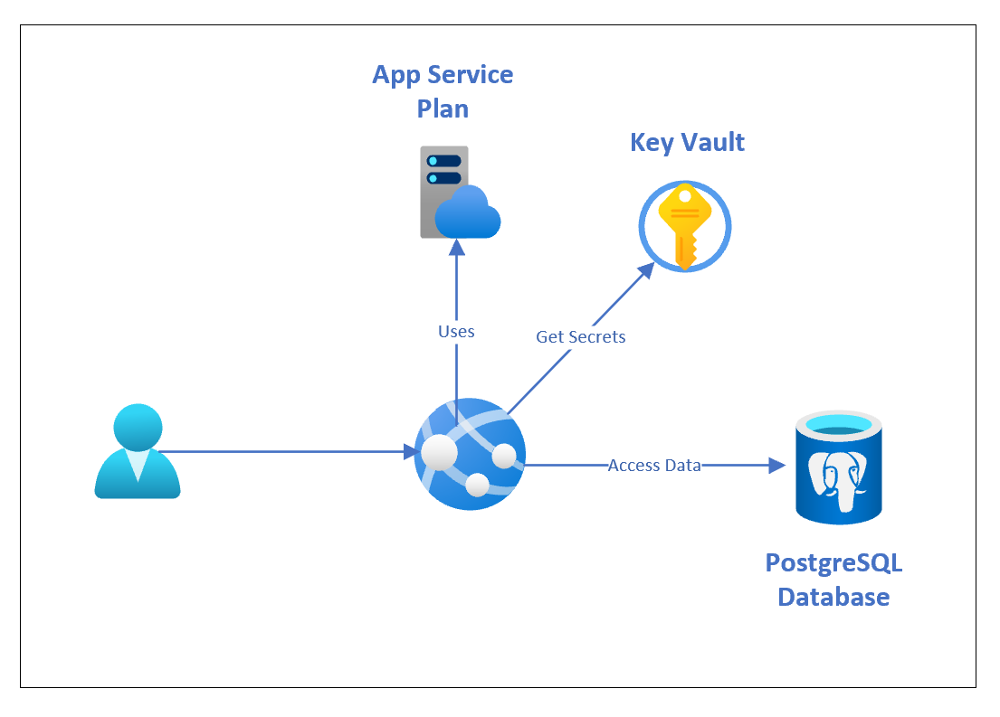

# Hands On Lab #6:  Python + PostgreSQL Application 

In this lab, you will be deploying an Azure App Service (with Python) & PostgreSQL.

## Documentation

* [Azure Key Vault Overview](https://docs.microsoft.com/en-ca/azure/key-vault/general/overview)
* [Managed identities for App Service](https://docs.microsoft.com/azure/app-service/overview-managed-identity?tabs=dotnet)
* [Use Key Vault references for App Service](https://docs.microsoft.com/azure/app-service/app-service-key-vault-references)
* [PostgreSQL Database Bicep Reference](https://docs.microsoft.com/azure/templates/microsoft.dbforpostgresql/servers?tabs=bicep)
* [Python on Azure App Service Troubleshooting](https://docs.microsoft.com/azure/app-service/configure-language-python#troubleshooting)

## Exercise #1

You will be deploying the entire environment through Bicep template.  This example is based on [Django web app with PostgreSQL in Azure App Service](https://docs.microsoft.com/azure/app-service/tutorial-python-postgresql-app) tutorial.

Diagram illustrates the Azure services & their dependency on each other:

Instead of manual deployment, you will use Bicep to:

* Deploy Azure Database for PostgreSQL Single Instance (Note:  you may not be able to deploy in `Canada Central` region.  Try `East US` if not possible)
* Deploy Azure App Service based on [Lab 05](../Lab-05)
* Deploy Azure Key Vault to store database connection string
* Integrate Azure App Service with Azure Key Vault to allow App Service to access connection string
* Provide username and password for the database using secure parameters

Note:  You will not be deploying the Django application in this exercise.

## Exercise #2

Deploy the [Django application using the instructions on Azure Docs](https://docs.microsoft.com/en-us/azure/app-service/tutorial-python-postgresql-app).

Ensure you can answer:

1. The purpose for Azure Key Vault
2. The recommended method for securing passwords and secrets and accessing them at runtime
3. The access control method for integrating Azure App Service & Azure Key Vault